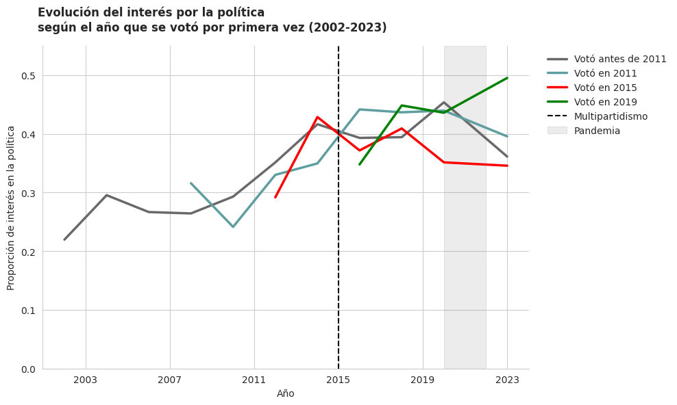

# Multipartism and Political Disaffection Among Spanish Youth: A Longitudinal Analysis

This project investigates the relationship between the breakdown of the traditional two-party system in Spain and political disaffection among young citizens. Specifically, it tests whether the emergence of a multiparty system around 2015—marked by the parliamentary arrival of new political actors like *Podemos* and *Ciudadanos*—acted as a catalyst to reduce political detachment and increase political interest among the youth.

> **_Note:_** The original investigation and report were written in Spanish.

---

## Table of Contents
- [Hypothesis](#hypothesis)
- [Methodology](#methodology)
- [Key Findings](#key-findings)
- [Conclusion](#conclusion)
- [References](#references)

---

## Hypothesis
* **H1:** The transition from a bipartisan to a multiparty system reduced political disaffection among young people in Spain.

---

## Methodology 
The study utilizes data from the **European Social Survey (ESS)** spanning Rounds 1 through 11 (2002–2023), filtering for respondents in Spain who reached voting age ($\ge 18$ years old) within the surveyed periods. 

* **Dependent Variable:** *Political Disaffection* — proxied via subjective political interest (`polintr`), recoded into a binary variable ($1$ = Very/Somewhat interested; $0$ = Little/Not interested).
* **Independent Variable:** *Political Generations* — defined by the cohort's first opportunity to vote based on their birth year:

| Generation | Birth Cohort | First Voting Opportunity |
| :--- | :---: | :---: |
| **Voted before 2011** | 1902–1989 | 1920–2007 |
| **Voted in 2011** | 1990–1993 | 2008–2011 |
| **Voted in 2015** | 1994–1997 | 2012–2015 |
| **Voted in 2019** | 1998–2001 | 2016–2019 |

### Statistical Strategies
1. **Descriptive Analysis:** Aggregating baseline trends and variances across cohorts.
2. **Graphical Visualization:** Plotting longitudinal trajectories of political interest.
3. **Inferential Modeling:** Adjusting a Generalized Linear Model (GLM) with a Binomial family (Logit link) and robust standard errors (`HC1`).

### Tools & Environment
The analysis was conducted in **Python** (Google Colab environment), leveraging the following stack:
* `pandas` and `numpy` for data manipulation.
* `statsmodels` and `scipy.stats` for statistical modeling and hypothesis testing.
* `seaborn` and `matplotlib` for data visualization.

> **_Code Access:_** You can find the data preparation and analysis script in the [Project Notebook](Notebook/compol.ipynb).

---

## Key Findings
Political interest has steadily **risen across all generations**, but **younger cohorts show a noticeably higher baseline engagement**:
* **Older Generations (Pre-2011):** Show an average interest proportion of **33.3%**.
* **The 2019 Cohort:** Displays the highest engagement, with an average of **45.2%** of respondents expressing political interest, peaking at nearly 50% in 2023.

However, the logistic regression reveals crucial nuances regarding what actually drives this engagement. Most generational differences lose statistical significance after controlling for time, providing evidence of a strong **period effect** rather than a clear *cohort effect*.

In fact, political interest increased among virtually all generations during the years surrounding the 2008 economic crisis and the *15-M Movement* (2011). Although younger cohorts tend to exhibit higher overall levels of interest, the data do not provide sufficient evidence to conclude that multipartism itself was the primary cause of this increase.

Instead, the rise in political interest appears more closely associated with broader cycles of **political mobilization** and social conflict that **preceded** the formal collapse of the bipartisan party system.

### Figure 1: Evolution of Political Interest (2002–2023)

---

## Conclusion
The initially proposed hypothesis (**H1**) requires a critical nuance. There is insufficient evidence to claim that the drop in political disaffection was a direct consequence of institutional multipartism. Rather, political interest increased across society as a whole, suggesting that the most important mechanism was a general period effect linked to political mobilization and crisis, rather than a lasting generational effect produced by the new party system.

This takeaway is reinforced by the fact that the sharpest increase in political interest occurred between 2010 and 2014, heavily influenced by the social mobilization cycles following the 2008 financial crisis.

However, the **2019 Generation** stands out as an anomaly: they maintained remarkably high political interest and were the only group whose engagement *increased* during the COVID-19 pandemic, suggesting they might have uniquely benefited from political socialization entirely embedded within a highly competitive, multi-party environment.

### Future Lines of Research
* Age–Period–Cohort (APC) advanced dynamics.
* The specific impact of the COVID-19 pandemic on civic apathy.
* Incorporating party identification and ideological scales.
* Longitudinal tracking to see if the 2019 cohort's high interest persists over time.

---

## References 
* Bauman, Z. (2003). *Modernidad líquida*. Fondo de Cultura Económica.
* Constant, B. (1989). *De la libertad de los antiguos comparada con la de los modernos*. Alianza Editorial.
* Forniés, Á. A. (2011). Causas y riesgos de la desafección política de los jóvenes. In *Jornadas la desafección política en la juventud española tras treinta años de vigencia de la construcción* (pp. 2-10). Fundación Manuel Giménez Abad.
* Montero, J. R., Gunther, R., Torcal, M., & Menezo, J. C. (1998). Actitudes hacia la democracia en España: legitimidad, descontento y desafección. *Reis*, 9-49.
* Putnam, R. D. (2000). *Bowling alone: The collapse and revival of American community*. Simon and Schuster.
* Sotillos, I. D. (2020). La formación de gobiernos en sistemas multipartidistas: la paradoja del caso español. *Teoría y realidad constitucional*, (45), 261-290.
* Tocqueville, A. de. (2005). *La democracia en América*. Alianza Editorial.

